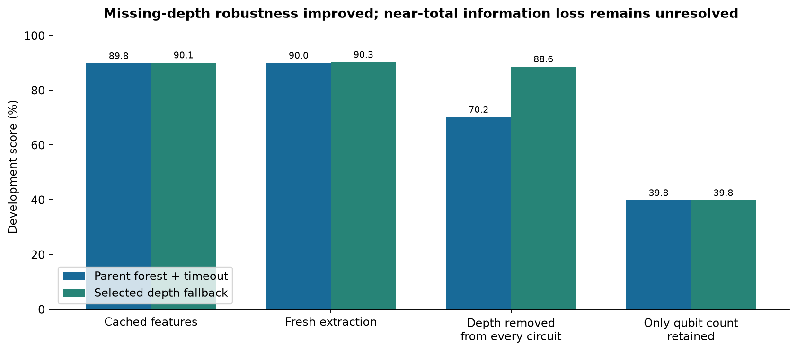
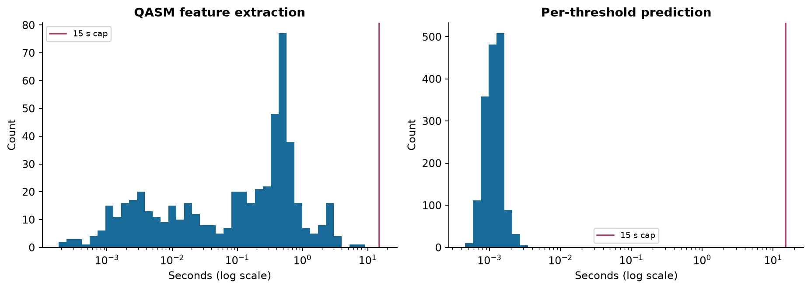

# Quantum Rings v5: data and deployment audit

> Archived research snapshot. References to local-only files and publication status describe the experiment at the time. This branch publishes the selected report and figures; its runnable model is now `quantathon-harness/model.py`.

## Scope

This supplements the v4 data report (local research artifact not included here) with training/inference consistency, missing-feature tests and the finished harness pipeline. The original runtime CSV and QASM files were read only. This phase fitted predictive models; it did not run Quantum Rings or generate new labels. The future organizer holdout is absent.

| Check | Measured result |
|---|---|
| Known circuits / labels | 532 / 1,497 |
| Full input-feature audit | 181,412 cells; 532 matching input hashes |
| Feature availability disagreements | 3 circuits / 380 cells, all budget-sensitive |
| Conflicting populated numeric values | 0 |
| Fresh exact counts / ordered sequences | 510 / 465 |
| Practice output | 1596 complete unique rows |
| Holdout output / scored labels | 321 / 301 |
| Max practice parsing / prediction | 7.4839 s / 0.0032 s |
| Peak process working set | 529.8 MiB |
| New simulator executions | 0 |

## 1. Data contract carried into modeling

There are 532 circuits and 1,497 measured rows: 1,464 successful rows and 33 official timeouts. A complete three-threshold grid would contain 1,596 rows, leaving 99 unobserved labels. Threshold 16 has 532 labels, 64 has 530, and 512 has 435. Missingness at 512 is concentrated in the other-QASM2 source group. These missing labels are never synthetic targets.

The successful 42,993.9847111-second row is retained exactly for evaluation. Primary training reinterprets it as censored at the four-hour bound, yielding 34 training-censored rows. Separate target-policy sensitivities are saved. A timeout means runtime is at least the bound, not a measured duration equal to it.

The earlier threshold-ratio audit remains relevant: success-pair median 64/16 is 2.4747; median 512/64 is 17.7048. There are 169 and 109 observed decreases in those respective paired views. Mixtures of fast and costly circuits motivate modeling hypotheses, but incomplete/censored pairs, timing floors and shared denominators complicate interpretation. We did not impose monotonicity or use neighboring observed runtime as an inference feature.

Anonymized circuit names are identifiers only. The source groups (190 Sycamore-like QASM2, 179 QASM3 and 163 other QASM2) are diagnostic populations. They are not true recovered algorithm families and do not enter the predictor. The earlier duplicate audit found no confirmed repeated circuits after qualified normalization; near-collisions are not direct repeat measurements of noise.

## 2. Frozen input and new inference audit

The v4 table remains 532 × 343 columns, including 325 selectable numeric candidates. No source table was overwritten. Its SHA-256 is recorded in `INPUTS_AND_SPLITS.json`; outcome and circuit-assignment hashes are recorded beside it. The selected predictor reads only generic circuit features and threshold, with a no-depth fallback, while the adapter retains the full research feature vocabulary.

A fresh pass read all 532 compressed sources, computed all 341 adapter fields, and compared 181,412 cells with the cache. Every decompressed-source hash matched the frozen v3 manifest. There were no disagreements between populated numeric feature values. Three circuits changed availability:

| Circuit | Difference | Interpretation |
|---|---|---|
| 0d08bd43.qasm | 146 fields | Structural pass previously exceeded its budget; fresh pass recovered counts/graph |
| 46073cb3.qasm | 146 fields | Same budget-sensitive recovery |
| e893b1a5.qasm | 88 fields | Fresh ordered pass exceeded its 3-second budget; cached ordered values were available |

Seven both-populated differences were exactness flags changing state; the remaining differences were null/populated transitions. Cached and live features therefore differ in coverage under load, not in conflicting qualified arithmetic. Both tables are preserved. Development score with fresh cached extraction was 90.27%, compared with 90.10% from the frozen training representation. The raw-QASM internal holdout agrees with the frozen-feature holdout to scorer precision. These comparisons did not trigger post-holdout retuning.

## 3. Parser boundaries and fallbacks

Extraction supports the reviewed QASM2/QASM3 subset, custom gate expansion and safe parameter interpretation. Unsupported blocks, unknown definitions, statement/expansion limits and expensive sources can return partial features. Structural extraction receives at most 7.5 seconds and the ordered extension at most 3 seconds inside an 11-second cooperative envelope. Input-size and operation limits protect expensive paths. Cooperative checks are not an operating-system hard kill; timing was measured on this machine, not promised for arbitrary hardware or unlimited input size.

Counts, graph and schedule qualification are distinct. A zero gate count is different from an unparsed circuit. Moment fields for absent parameter groups can be null while angle count is zero; unresolved parameters are masked. The final model does not rely on the angle extension, but these semantics remain correct for future research.

The full fresh audit's largest parsing time was 7.511 seconds. The focused largest-file test used approximately 218 million decoded characters and returned a valid partial representation. The unchanged harness reads and decompresses an entire file before starting its parse timer; therefore parse time excludes decompression and the process peak memory includes whole-file text and model state.

## 4. Accuracy under missing features

The final no-depth branch raises an artificial all-depth-missing scenario from 70.21% to 88.64%. It also improves the 96 naturally depth-missing development rows. The n-only fallback prototype was rejected because it hurt naturally incomplete records. If essentially all structural information is lost, the remaining model has weak discriminatory power: the deliberate all-but-qubit masking scenario scores 39.83%. Keep that limitation visible when discussing robustness.

The model still returns a finite positive prediction for malformed, empty, unsupported and missing-field inputs. With no usable information or a failed model load it returns a training-derived threshold median. This prevents skipped rows; it does not create information absent from the circuit representation. Future work should prioritize unsupported control-flow/count extraction and external source transfer.

## 5. End-to-end harness evidence

The copied run.py, score.py and requirements.txt match their authoritative originals byte for byte. Only model.py is changed for inference. All estimator parameters and parser helpers are embedded there, so deployment does not assume analysis packages. Compressed inputs use the supplied harness's declared zstandard dependency; no package installation or environment change was made by this phase.

| Population | Parse median / p95 / max | Predict median / p95 / max |
|---|---|---|
| Full practice corpus | 0.1856 / 2.0648 / 7.4839 s | 0.0012 / 0.0017 / 0.0032 s |
| Internal holdout | 0.1038 / 1.1512 / 3.0889 s | 0.0011 / 0.0017 / 0.0025 s |

The full practice run took 218.6 seconds overall and peaked at 529.8 MiB working set. Both CSVs have exact expected keys, no duplicates, no invalid durations, no missing predictions and no 15-second cap violations. The internal CSV has 321 predictions but only 301 measured targets; the 20 unlabeled pairs remain valid predictions. The practice CSV has 1,596 predictions but only 1,497 measured targets.

The full-training practice score is **96.49%, in-sample**. It is an integration check only. The original scorer's held-out accuracy is **89.88%**, and the organizer's hidden accuracy is unknown.

## 6. Tests, failures and ownership

- **Sol — tabular estimators:** six controls, JSON portability, float32 tree routing, neighbors/ties, one-row and all-censored fallbacks. Additional independent protocol tests check fold-local preprocessing, target-field independence, held-out-label perturbation, anomaly policies, score.py handcases and reserved-fold rejection.
- **Luna — mixtures and censored likelihood:** two/three-component target mixtures, feature-only routing, component fallback, hard/soft portable parity; lognormal AFT survival direction, finite-difference gradient and extreme tails. Synthetic gradient error was approximately 6.65e-11.
- **Sol — extraction and deployment:** qualified parity, custom bindings, missing parameter masking, bounded largest-input behavior, complete 532-circuit audit. The real exported model passed 5 QASM fixtures, 78 prediction edge cases and 270 exact bundle/reference prediction comparisons.
- **Luna — preflight and research review:** duplicate normalized filenames, plain/compressed collisions, suffix rules, empty folders, expected output keys, CSV values and timers; independent interpretation of GMM/censoring/feature/stress evidence.
- **Root — integration:** exact-score grouped comparisons, input hashes, timestamped selection lock, missingness refinement, final all-label refit, original-harness runs, figures, reports and publication manifest.

The independent review caught an unsupported-threshold native/export mismatch, incomplete protection against accidental reserved-fold arguments, and a cache reuse rule that did not check input/code hashes. All were fixed. The original initial comparisons already excluded the reserved fold and did not reuse stale outputs; the selected parent was subsequently reproduced exactly. Future result reuse requires matching code, input and split fingerprints. Failed model hypotheses and the rejected qubit-only fallback remain in the experiment ledger.

## 7. Delivery and remaining dependencies

`submission_v5/model.py` is the ready inference implementation. `practice_submission.csv` uses the placeholder team **VALIDATION_ONLY** and known training circuits; it is not the final competition submission. Follow `RUN_SUBMISSION.md` after the actual hidden circuit folder and real team name are available. Preflight rejects duplicate basenames even across subfolders, because the harness emits basename keys rather than relative paths.

We have not sent files to organizers. The actual hidden set, team name and optional released labels are future inputs. Organizer questions still include exact threshold semantics/SDK version, authoritative score wording, the over-cap success, execution settings and dependency/memory limits. Additional simulator compute has not been started. W&B status is recorded separately in `upload_status.json`; raw QASM, credentials and package caches are excluded from its staged payload.

## Artifact map

`PROTOCOL.md` and `SELECTION_LOCK.json`: decision boundaries. `INPUTS_AND_SPLITS.json` and `split_manifest.csv`: reproducibility. `experiments/`: configurations, fold diagnostics and predictions. `inference_adapter/`: source parity and deployment checks. `tabular/`, `mixtures/`, `submission_tools/`, `research_review/`: agent handoffs and tests. `holdout_scored_rows.csv`, `DELIVERY_CHECKS.json` and harness logs: final evaluation. `MODEL_REPORT.md/html`: model decision. `figures/`: nine PNG/SVG graphs; each has source tables or deterministic calculations in `make_reports.py`.
