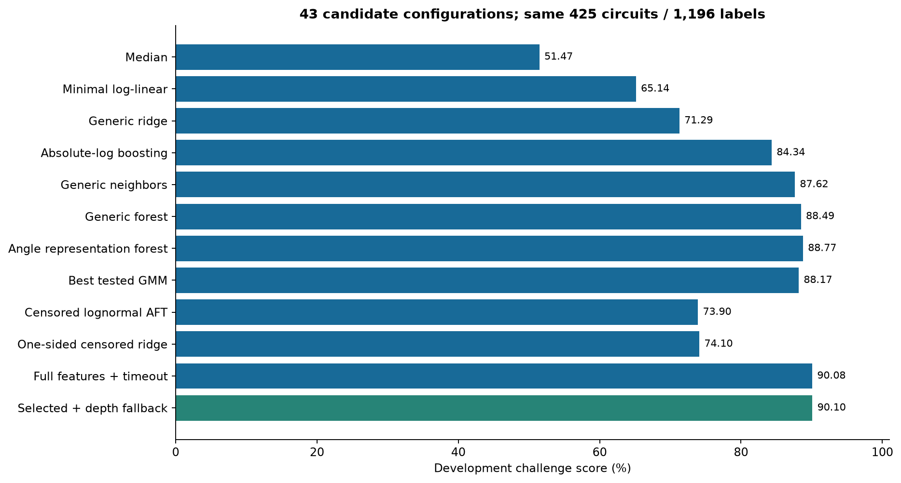
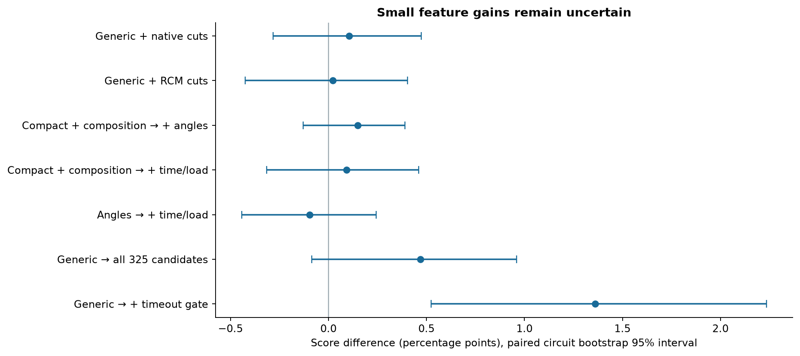
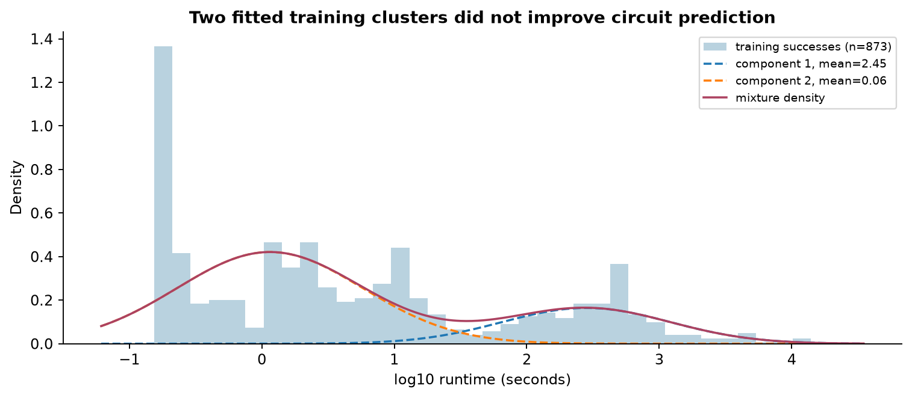
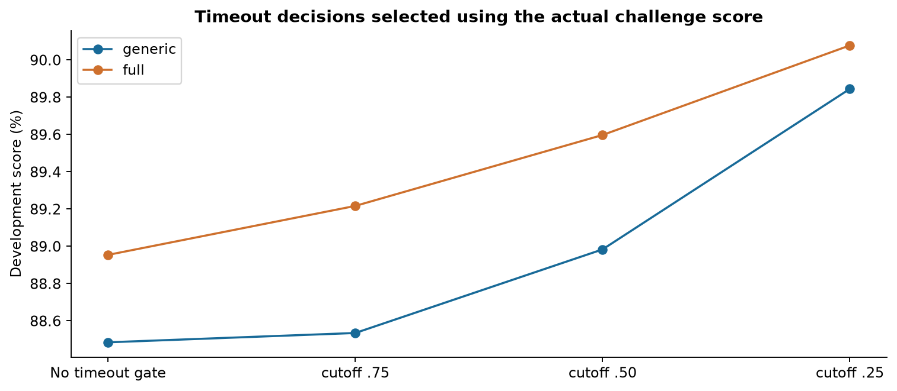
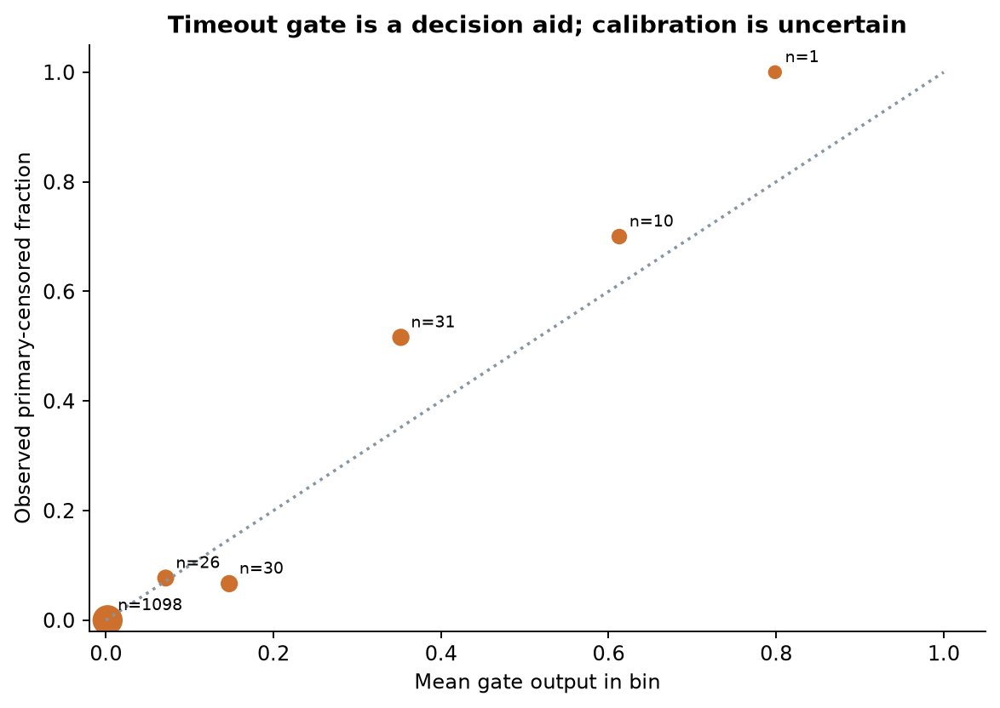
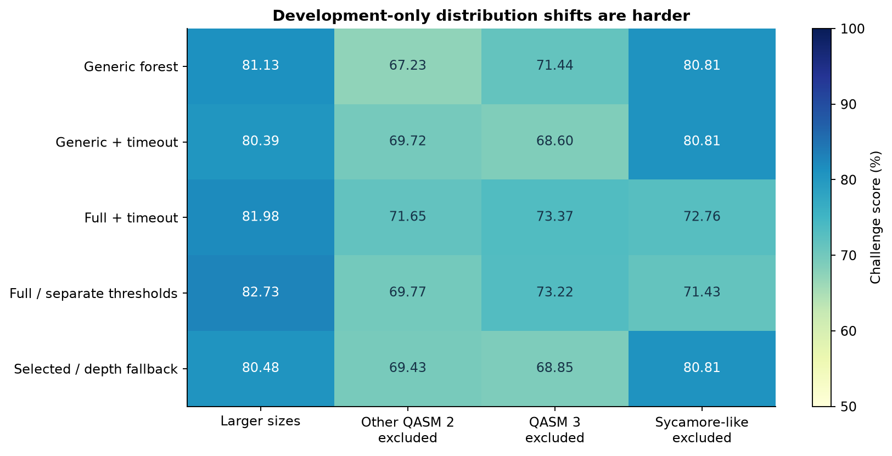
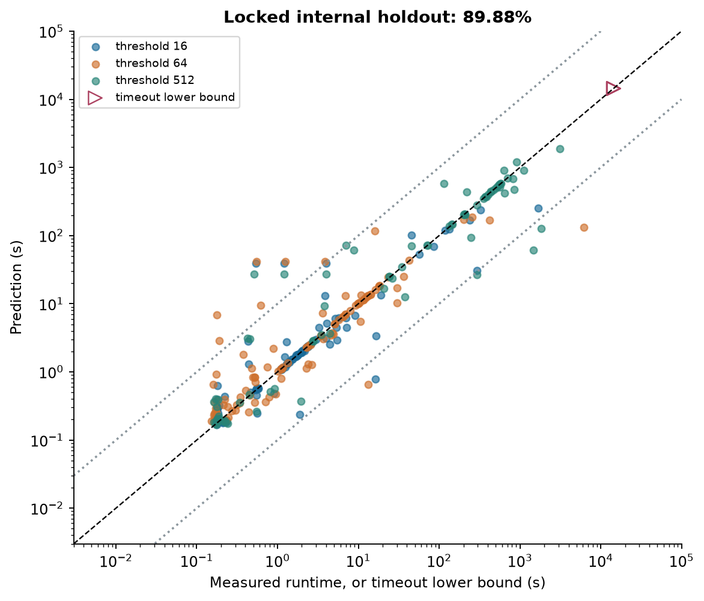

# Quantum Rings v5: model decision and evidence

> Archived research snapshot. References to local-only files and publication status describe the experiment at the time. This branch publishes the selected report and figures; its runnable model is now `quantathon-harness/model.py`.

## Decision

Use a pooled **ExtraTrees regressor on log10 runtime**, a separate **timeout decision forest**, and an additional predictor for circuits whose depth cannot be extracted. The requested threshold is a predictor. The model uses generic circuit counts, depth and five SupermarQ-style metrics. It uses no filename lookup, measured runtime at another threshold, source-group label, or hidden-set information.

| Evaluation | Population | Score |
|---|---|---|
| Grouped development selection | 425 circuits, 1,196 labeled runs | 90.10% |
| Locked internal holdout, original harness/scorer | 107 circuits, 301 labeled runs | 89.88% |
| Future organizer hidden set | Not supplied here | Not evaluated |

The internal holdout appeared in earlier descriptive data analysis. It was excluded from all new-model selection, but should not be called a pristine blind test. The configuration was locked at **2026-09-26T21:25:24.156149+00:00** before its score was opened. The final submission model was subsequently refitted on all 532 known circuits / 1,497 labels.

## 1. Optimize the actual score

For successful rows, retain the literal measured duration `a`. For official timeouts set `a = 14400` and replace prediction `p` by `min(p,14400)` for scoring. Then floor `p` at `1e-9` and score:

`max(0, 1 - abs(log10(p / a)) / 2)`

Average over evaluated rows. Missing predictions score zero. Over- and under-prediction are symmetric in multiplicative error on successes; 10x error earns 0.5 and 100x earns zero. Timeout predictions at or above 14,400 earn full credit. A successful prediction at or above that bound does not automatically earn full credit. The README's 10x/zero language disagrees with executable score.py; the organizer question remains open.

The final forest fits squared error in **log time**, rather than raw seconds. Absolute-log-loss boosting was tested and scored worse. Selection used the exact challenge score, including its clipping and timeout behavior. Thus loss alignment comes from log targets, explicit timeout decisions and measured score comparisons; we do not claim squared error is algebraically identical to the scorer.

## 2. Architecture and feature availability

1. Parse each new QASM once with bounded, standard-library extractors. Unavailable fields remain unavailable; an absent gate type is valid zero.
2. If counts exist but depth-related fields do not, use the separately trained no-depth branch. Otherwise use the main branch, including its learned handling of missing counts.
3. Apply training-fitted signed-log transforms, medians, centering/scaling and missingness indicators. Constant or poorly supported fields are removed using training data only.
4. Predict log runtime with 160 ExtraTrees (minimum leaf size 2). A second forest with 120 trees and minimum leaf size 5 estimates the primary censoring indicator from features. It is implemented as regression on 0/1, so leaf means behave as empirical class proportions.
5. If gate output is at least **0.25**, predict 14,400 seconds; otherwise exponentiate the success regressor's log prediction. The gate output is not claimed to be a calibrated timeout probability.
6. Unexpected failures or wholly absent structural information fall back to a per-threshold training median. All outputs are finite positive values. Only thresholds 16, 64 and 512 are supported by the challenge; malformed or other thresholds normalize to 64 as a defensive boundary.

There are 44 named generic circuit candidates before threshold encoding and fold-local pruning. The final main branch retains 48 transformed values, plus one missingness indicator per value. The no-depth branch retains 44 values plus indicators. Exact names, medians, transforms, thresholds and trees are serialized; the final model requires no sklearn, NumPy, Qiskit, torch or QASM importer at inference. See `final_fit_diagnostics.json`, `FEATURE_SETS.json` and the model bundle for exact definitions.

This branch choice uses feature availability, not inferred physics regimes. The full extraction adapter retains the broader research representation for reproducibility, but angles, RCM cuts, workload extensions and source identity are not predictors in the selected model.

## 3. Controlled comparisons

All 43 screened configurations use the same four development folds, all thresholds of each circuit together, and disjoint saved structural groups. Mixtures, imputers, scalers, constant removal, regressors and gates are fitted inside each training fold. Per-fold predictions, train-key hashes, seeds, configuration and timing are saved. No new simulations were run.

| Candidate | Development score |
|---|---|
| Median | 51.47% |
| Minimal log-linear | 65.14% |
| Generic ridge | 71.29% |
| Absolute-log boosting | 84.34% |
| Generic neighbors | 87.62% |
| Generic forest | 88.49% |
| Angle representation forest | 88.77% |
| Best tested GMM | 88.17% |
| Censored lognormal AFT | 73.90% |
| One-sided censored ridge | 74.10% |
| Full features + timeout | 90.08% |
| Selected + depth fallback | 90.10% |

The initial median and three-variable log-linear controls establish the available signal. Simple trees on engineered generic features substantially improve those controls. Neither the tested nearest-neighbor representation nor absolute-log boosting beats the selected approach. This is a bounded comparison of the recorded configurations, not a claim that every possible boosting or neighbor model is inferior.

## 4. What feature engineering earned

Native and RCM cuts were added directly to the generic baseline. Other contrasts change representations: compact structure plus normalized composition is a different base from the generic per-gate counts. Angles versus composition and temporal/load versus composition are the genuine nested block comparisons. `matched_contrasts.csv` distinguishes these cases.

The broad 325-candidate forest improved the generic forest by 0.47 percentage points, but its paired 95% interval crosses zero. Native/RCM cut and angle-block gains were also small or uncertain. Timeout handling gave a larger measured benefit. Pairwise intervals use 2,000 whole-circuit resamples; they are not corrected for searching many candidates. Correlated features also make tree impurity importance unsuitable as causal evidence.

The full-feature timeout model scored 90.08%, versus the selected model's 90.10%. This tiny difference does not establish superiority. The choice favors generic features and the demonstrated depth fallback. Angle features still resolve previously indistinguishable circuits in the data audit; representation separation alone did not establish a reliable predictive gain in these experiments.

## 5. GMMs: useful research, rejected for deployment

Each GMM sees only successful training log runtimes. Two or three fitted components generate training assignments. A feature-only ExtraTrees gate predicts those assignments for a new circuit; weighted regression experts supply predictions. Both hard selection and probability-weighted log predictions were tested. Small or missing components trigger a global success-model fallback. Censored values are not inserted into the GMM as exact runtimes.

The best tested mixture scored 88.17%, below its angle-forest control (88.77%) and the selected model. Two fitted runtime modes are compatible with mixed circuit sources, thresholds, overheads and other latent factors. They do not establish two simulator execution modes or identify a bond cap. A runtime GMM also introduces a second prediction problem: correctly routing unseen features into a component. No held-out runtime was used to choose a route.

## 6. Censoring and the unusual success

Primary training uses **34 censored rows**: 33 official timeouts, plus the 42,993.9847111-second successful record treated as a bound at 14,400. Scoring always preserves the original 33 timeout statuses and the literal unusual success. Missing labels are never filled by monotonic interpolation; observed threshold inversions rule that out.

A proper linear lognormal AFT likelihood used exact Gaussian log-runtime densities for successes and survival probabilities for censored bounds. The one-sided linear surrogate used a smooth absolute-like loss plus a lower-bound penalty. They scored 73.90% and 74.10%. Their tested linear representations were substantially weaker than the nonlinear two-stage forests. This comparison does not establish that all nonlinear survival models would fail.

Cutoffs .25, .50 and .75 were explicitly compared on development folds. At .25, the generic parent improved from 88.49% to 89.85%. Literal and anomaly-excluded training sensitivities on that parent scored 89.35% and 89.33%, versus 89.85% for the primary policy. Those are parent-architecture sensitivity checks, not independent hidden tests or proof of the anomaly's true status.

The diagnostic bins above use out-of-fold outputs from the parent gate. Small numbers of timeouts make calibration estimates uncertain. Final timeout decisions are defended by scored outcomes, not a claimed calibrated probability.

## 7. Missing features: tested benefits and limits

The original generic timeout model scored 70.21% when depth features were removed from every development circuit. The selected no-depth branch restores **88.64%**, while ordinary development performance rises from 89.85% to 90.10%. On the 96 naturally depth-missing rows, the branch improves 77.60% to 80.83%.

The qubit-only expert was rejected: it worsened the 54 naturally count-missing rows from 64.32% to 46.08%. Deliberately removing every signal except qubit count still yields only **39.83%** with the selected pipeline. Finite output is guaranteed by the defensive boundary; high accuracy with almost no circuit information is not. Unknown syntax that forces this degree of information loss remains a real deployment limitation.

## 8. Generalization and the held-out check

| Content group | Development rows / score | Internal holdout rows / score |
|---|---|---|
| Other QASM 2 | 312 / 86.85% | 80 / 86.49% |
| QASM 3 | 428 / 82.92% | 107 / 82.36% |
| Sycamore-like QASM 2 | 456 / 99.07% | 114 / 99.32% |

Sycamore-like circuits are easier on these splits than QASM 3 and other QASM 2 circuits. These are source/content groups, not recovered algorithm families: filenames are anonymized and true family labels were not reliably available. Structural grouping and size/source stress tests reduce optimistic leakage, but cannot guarantee the hidden source distribution.

| Development stress split | Selected score |
|---|---|
| larger distinct sizes | 80.48% |
| leave other qasm2 out | 69.43% |
| leave qasm3 out | 68.85% |
| leave sycamore like qasm2 out | 80.81% |

These stress splits overlap the development corpus, so they should not be averaged into an independent headline validation estimate. The drop under source exclusion is a material limit. Threshold 512 is also selectively missing for many other-QASM2 circuits, which weakens conclusions about that part of the target distribution.

The actual harness emitted 321 predictions for 107 circuits × 3 thresholds; only 301 corresponding measured labels exist. The supplied scorer evaluated all 301 without missing predictions and reported **89.88%**. The architecture was not adjusted after seeing this result. The final refit uses all labels for the upcoming organizer set; its practice score is in-sample and is not another generalization estimate.

## 9. Deployment and recorded checks

The original run.py and score.py are byte-for-byte preserved. The selected predictor and its weights are embedded in one `model.py` (9.01 MB). A standard-library-only isolated process passed five QASM fixtures, 78 malformed/missing-input prediction cases, unavailable-model fallbacks and exact exported prediction parity for 270 cases. Training-library versus portable prediction differences were about 1e-14 in log10 units.

All 532 known circuits produced a **1596-row practice CSV**, with unique complete keys, finite positive durations and zero cap violations. Maximum extraction was **7.4839 s**; maximum prediction was **0.0032 s**. See the separate data/deployment report for timing boundaries, feature parity, peak memory and test inventory.

## 10. What to do when the organizer holdout arrives

Use the prepared `submission_v5` folder and its `RUN_SUBMISSION.md`. Put only the actual holdout circuits in a fresh folder, run the preflight, enter the real team name in the unchanged harness command, and validate the resulting CSV. If labels are released, run the unchanged scorer. If they are withheld, submit the validated CSV and retain the organizer's returned score. No organizer score exists in this report, and no submission has been sent.

Before further modeling, useful new information would be actual family/source coverage, the exact SDK/threshold semantics, timing methodology, dependency/memory rules, and clarification of the over-cap success/scorer mismatch. Additional simulator labels remain contingent on rules and explicit compute approval. The next scientific work should focus on remaining parse failures and source transfer; the current evidence does not justify a GNN or a more complicated runtime mixture.

## References and reproducibility

- [Quantum Rings run settings](https://www.quantumrings.com/doc/usage/run_settings.html): threshold is an execution/performance setting; a precise bond-dimension interpretation remains unconfirmed here.
- [MIT iQuHACK Quantum Rings study, arXiv:2606.11620](https://arxiv.org/html/2606.11620): motivates simulator-specific cut/order features and grouped validation; its benchmark is not our hidden set.
- [Ma & Li, arXiv:2411.15631](https://arxiv.org/html/2411.15631v2): motivates cheap generic circuit features; backend calibration features and uncensored short-run results do not transfer directly.
- [SupermarQ](https://users.cs.northwestern.edu/~hardav/paragon/papers/2022-HPCA-SupermarQ-Tomesh.pdf): generic communication, critical depth, entanglement ratio, parallelism and liveness metrics. Implementation conventions are recorded in our v3 dictionary.
- [Scikit-learn GMM documentation](https://scikit-learn.org/stable/modules/mixture.html): component fitting and probabilistic assignments.

Reproduce using `PROTOCOL.md`, `INPUTS_AND_SPLITS.json`, `FEATURE_SETS.json`, `experiments/`, `SELECTION_LOCK.json`, `final_model.json`, `build_submission.py`, `DELIVERY_CHECKS.json` and agent handoffs. The old baseline and all v4 data remain preserved. The W&B publication status is recorded separately in `upload_status.json`; local completion does not imply an upload completed.
