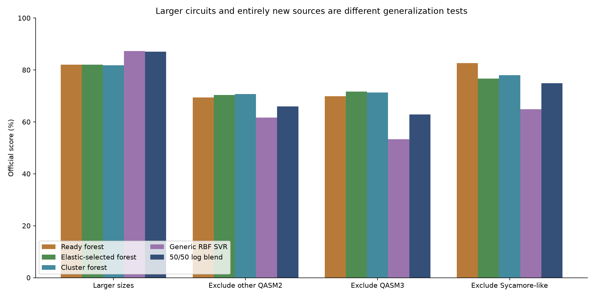
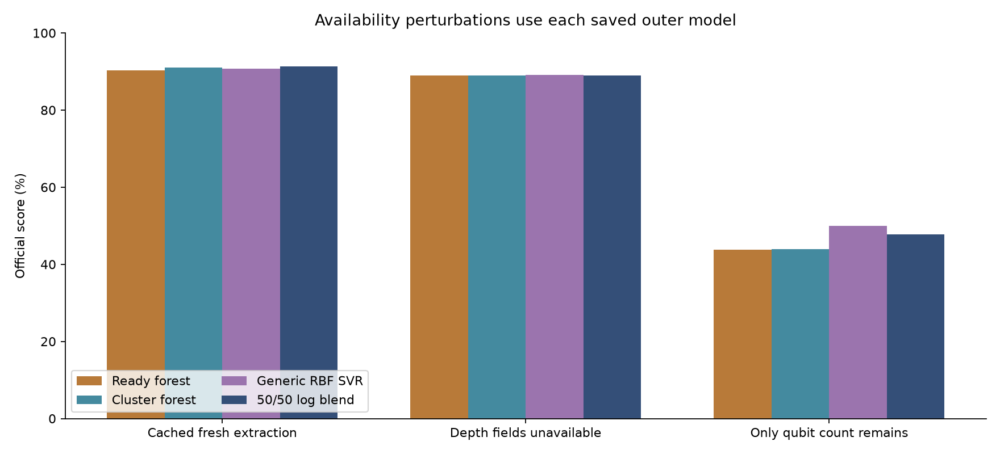

# V6 decision and next steps

> Archived research snapshot. "Everything remains local" below describes the status when this analysis closed; this branch publishes the selected reports and figures. The v6 candidates remain unpromoted.

## Decision

**Keep the existing all-data v5 submission as the ready default.** The fixed equal-weight forest/SVR blend is the ordinary grouped-CV leader at **91.19%**, above the reference's **90.30%**. Its paired group-bootstrap gain is **+0.89 percentage points [0.38, 1.40]**, and all five folds improve. Those are exploratory, selection-affected estimates. They do not establish that the blend is best for an unknown source mix.

The source-exclusion tests materially change the recommendation: the blend loses 3.49, 7.03 and 7.81 points against the reference when other QASM2, QASM3 and Sycamore-like QASM2 are each excluded from training. The cluster forest has **91.02%** ordinary CV and smaller losses on this stress suite, but it still loses **4.71 points** on the new Sycamore-like source. The elastic-selected forest reaches **91.12%** CV with 59–134 selected fields across folds; its stress scores improve on the reference for larger sizes, other QASM2 and QASM3, but fall **6.04 points** for Sycamore-like circuits. The generic RBF kernel helps size extrapolation while struggling with entirely new feature distributions. These tests are conservative stress scenarios, not a forecast of the organizer's unknown source mixture. There is no uniquely proven best model across them.

## Stress results

| Test | Labels | Reference | Elastic forest | Cluster forest | RBF SVR | Equal log blend |
| --- | --- | --- | --- | --- | --- | --- |
| Larger sizes | 452 | 82.00% | 82.04% | 81.75% | 87.29% | 87.06% |
| Exclude other QASM2 | 392 | 69.38% | 70.37% | 70.74% | 61.65% | 65.89% |
| Exclude QASM3 | 535 | 69.90% | 71.61% | 71.26% | 53.32% | 62.87% |
| Exclude Sycamore-like | 570 | 82.68% | 76.63% | 77.97% | 64.85% | 74.86% |

All source/size predictions use held-out structural groups. The source labels are content/source proxies, not verified algorithm families; the other-QASM2 group mixes origins. SVR hyperparameters are tuned on each stress training portion only. The source stress tests use overlapping populations; do not average them into a headline score or treat them as independent trials. The two additional source splits were added after ordinary CV results and before their stress outcomes. The root independently reproduced the agent's blend calculation.

Elastic stress tests reproduce the standalone ElasticNet inner selector followed by the final forest, gate and fallback. Their alpha/L1 choice is training-only; selected inner and final selector fits converged. All four tests are follow-ups to its strong ordinary CV result. Artificial missingness scenarios below were evaluated for the reference, cluster forest and RBF/blend; no elastic-forest missingness result is claimed.

## Missing-feature results

| Available inputs | Reference | Cluster forest | RBF SVR | Equal log blend |
| --- | --- | --- | --- | --- |
| live | 90.37% | 91.08% | 90.73% | 91.27% |
| missing_depth | 88.92% | 88.93% | 89.09% | 89.02% |
| qubits_only | 43.75% | 43.87% | 49.99% | 47.74% |

The missing-depth specialist remains useful. When almost all structure is removed, every model is weak; better performance than the reference in that extreme does not make the predictions reliable. The fresh-feature scenario uses a previously saved extraction audit, not a newly timed parser pass.

## All-data training and portability

The new generic RBF research artifact is fitted on all **532 circuits / 1497 labels**: 1463 observed-success rows train the runtime regressor and 34 censored rows also inform the shared gate. Its final three-fold training-only selection chose C=100, gamma=1/transformed dimension and epsilon=.03. It has 1019 support vectors and converged. This final tuning score is not a second independent evaluation.

The isolated standard-library probe produced **1596 positive finite predictions**, plus 15 edge-case predictions. Prediction time was median **0.0196 s**, p95 **0.0289 s**, maximum **0.0347 s** on this machine. Numpy/sklearn were not loaded. This verifies the exported inference functions on cached features; it is not a new end-to-end harness acceptance test. The research SVR/blend has not replaced `submission_v5`, and no new official submission was made.

The existing v5 submission already trains on all 532 circuits and has its original harness evidence. The new SVR portable JSON and training manifest are in `svr/final_all_data/`; its validation estimates are the saved outer predictions, not in-sample scores. Generic linear SVR is ineligible for promotion because one selected outer fit did not converge; all three RBF procedures' selected fits converged.

## What the feature work tells us

Correlated-feature pruning is model-dependent. Cluster representatives improve this forest but worsen RBF SVR compared with the compact generic input. Strong permutation effects can coexist with near-zero deletion effects because another block can replace the information after refitting. For example, temporal/barrier permutation loses 7.64 points, while deleting that block and retraining slightly improves this forest. Native and RCM cuts show the same distinction on a smaller scale. This supports retaining multiple measurement methods rather than treating any one ranking as truth.

The core size/count block has the largest positive deletion effect, roughly .54 points; angle summaries add about .22 points in this setup. The paired deletion intervals in the feature report must accompany these small effects. No conclusion here proves a simulator bond cap or causally identifies an entanglement mechanism.

## Next round — planned, not started

1. **Train-only distance-aware blending.** Use circuit-feature distance or kernel similarity to reduce the SVR contribution on unfamiliar inputs, falling back toward the forest. Derive distance scales from training circuits, tune the blending rule only in grouped inner folds, and assess all four stress tests. Avoid source/file-name rules or a gate trained on outer-test errors.
2. **Trend plus residual SVR.** Give the prediction an explicit regularized size/threshold trend and train SVR on residuals. Compare with the forest/SVR blend using the same score and censor policy. This tests a way to reduce an RBF model's tendency toward a constant away from its training support.
3. **Test selection stability, not a universal rank.** Carry a compact generic representation, the forest's cluster representatives and any stable supervised subset into those tests. Use training-fold selection frequencies and deletion intervals; do not reuse a full-data feature ranking as a CV selector.
4. **Address timeout decisions separately.** Preserve censoring and the working gate initially; tune any new gate or expected-score decision only inside grouped training folds, with explicit false-timeout costs on successful rows. Recheck the single over-cap success under the already documented sensitivity policies.
5. **Promote once.** Choose the pipeline and tuning rule, fit all components on all available data, package it as one portable model, and run the original harness and inference fallback/timing checks. Keep the previous ready submission until that passes. Use the organizer's true hidden set only when provided.

Everything remains local. W&B v4 is unchanged; no v5/v6 upload was attempted. No Quantum Rings simulation or extra runtime-label compute was performed.
