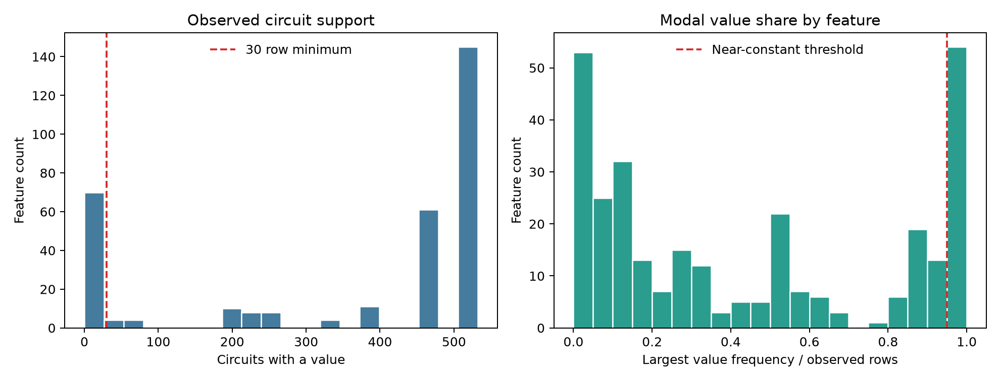
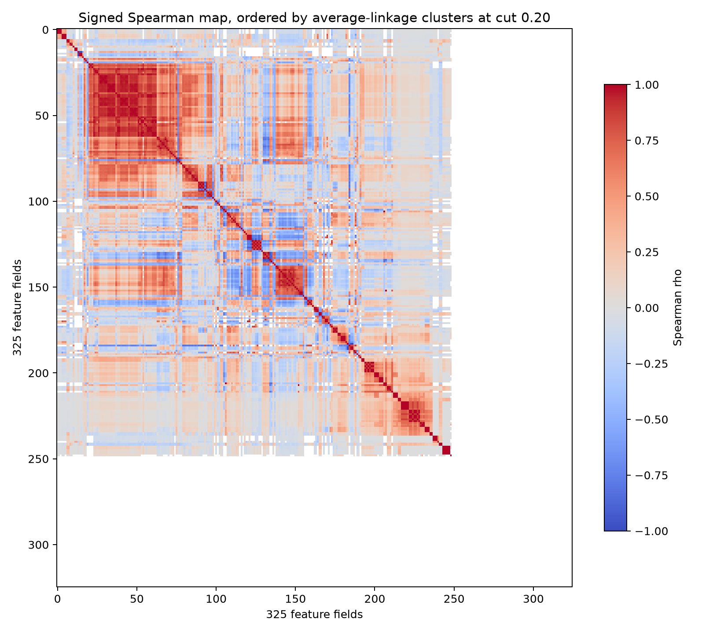
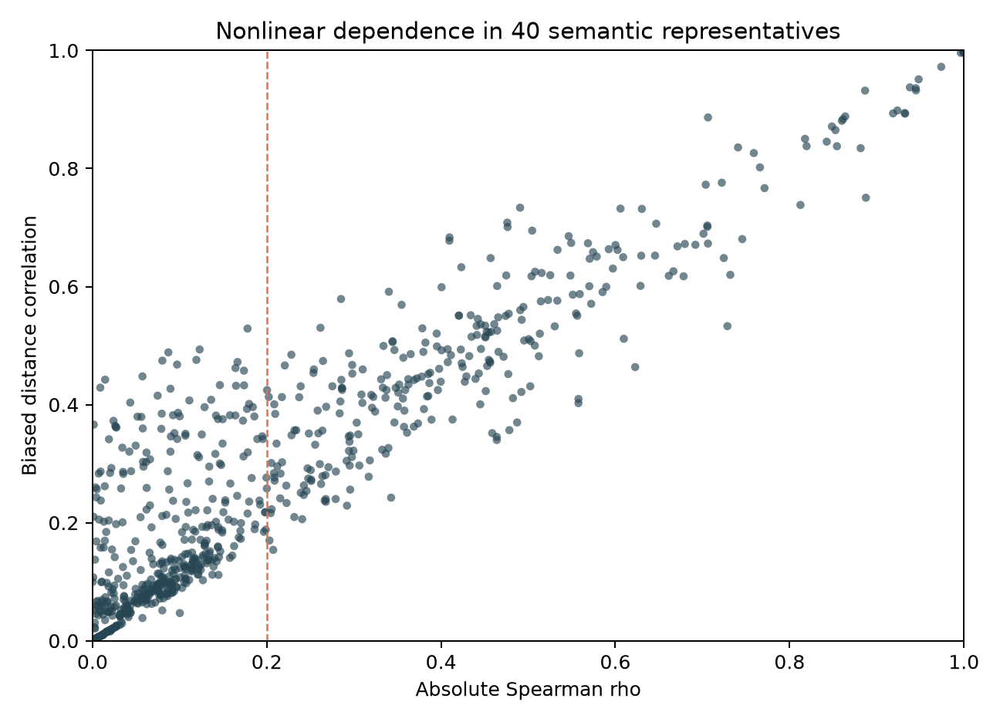
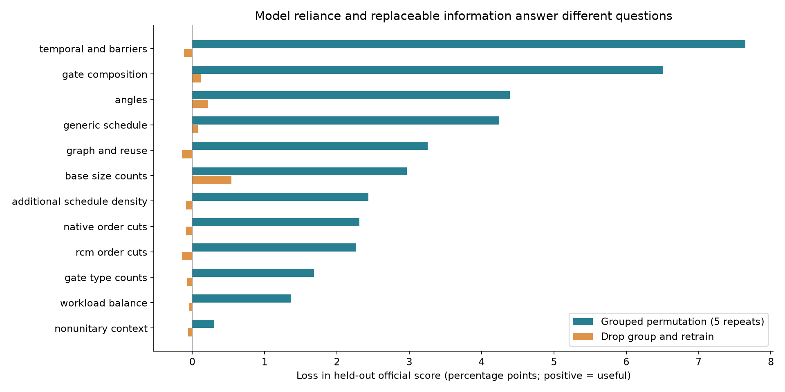
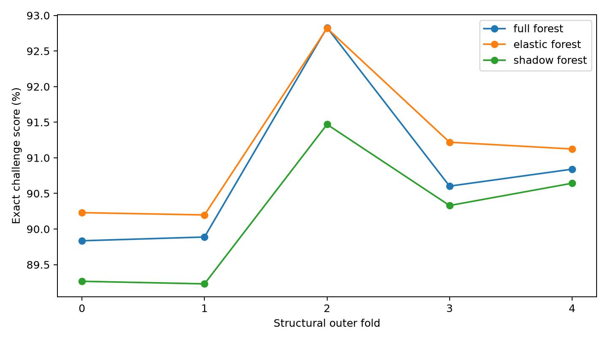
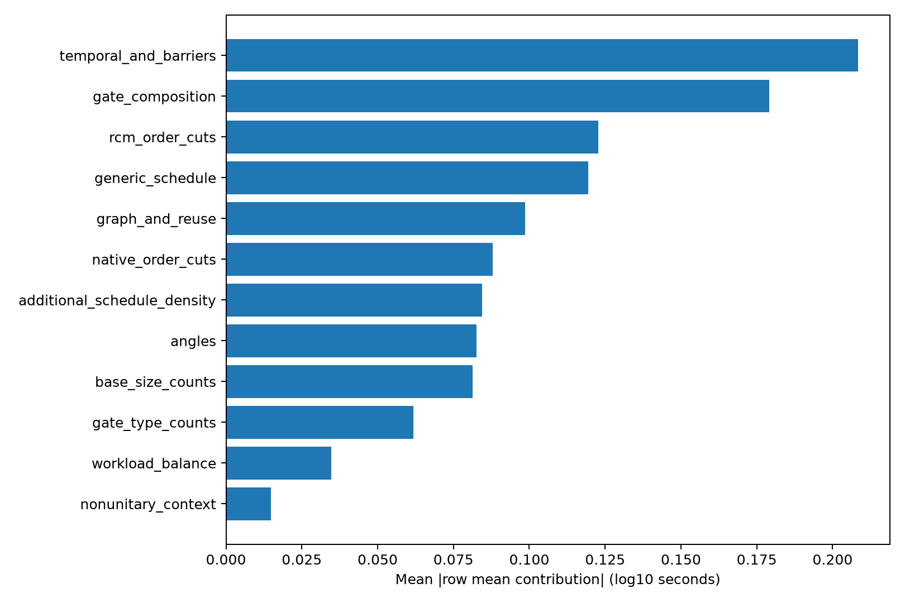

# Quantum Rings v6: feature evidence and redundancy

> Archived research snapshot. References to local-only files describe the experiment at the time; this branch publishes the selected report and linked figures. The v6 candidates remain unpromoted.

## What is being measured

This report examines 325 candidate circuit fields on **532 unique circuits**, not 1,497 independent circuits. Labels repeat across thresholds, while the circuit feature vector does not. Descriptive feature diagnostics use all circuits; predictive selectors are fitted inside training folds. The full methods, feature names and audits are in `redundancy/REPORT.md` and `importance/REPORT.md`.

## Coverage and redundancy

- 24 fields have no observed values and seven are constant over observed values.
- 70 fields have fewer than 30 observed circuits; 324 have at least one missing value.
- 54 fields have one value occupying more than 95% of observed support. Missing and true zero are separate.
- Of 52,650 distinct off-diagonal feature pairs, 20,489 have fewer than 30 shared observations. A supported pair can still have undefined correlation if it is constant on that shared subset.
- 308 pairs have absolute Spearman correlation at least .95; 138 reach .99.
- Examples of exact duplicate observed columns are two-qubit count / interaction multiplicity, two-qubit density / generic program communication, and wrapped absolute angle mean / zero-distance mean. Equality in this sample is not a universal semantic equivalence claim.

Spearman tests monotone association. Pearson uses signed log1p-transformed values, suitable for counts with large dynamic ranges while preserving negative parameter summaries. Both use pairwise-complete observations and store pair support. High correlations can reflect circuit-size/source mixtures or a few rare events. Reset statistics with identical sparse support should not be interpreted as strong independently replicated physics.

White cells are undefined coefficients caused by insufficient support or constant values; they are different from near-zero correlations in the middle of the color scale.

Average linkage uses distance one minus absolute Spearman correlation. Unsupported/undefined pairs get distance one, meaning they are not joined on unavailable evidence. The cuts .05, .10, .20 and .35 give 213, 190, 164 and 130 clusters, respectively, including unsupported singleton fields. Exact membership persistence across cuts and resampling stability are different diagnostics. The 30-resample bootstrap covers eight large descriptive groups containing 88 distinct fields; it is not a bootstrap of every group or independent validation.

## Nonlinear dependence and multivariate redundancy

Distance correlation is computed on a target-free 40-field representative panel, using a biased V-statistic and pairwise-complete data. Its median is .243; 329 of 780 distinct pairs are at least .30. It can reveal nonlinear relationships missed by Spearman: the synthetic U-shaped check has Spearman near zero and distance correlation .491. The positive finite-sample bias means .30 is descriptive, not a significance threshold. No mutual-information claim is made because this round implements distance correlation instead.

After median imputation and standardization, 294 fields vary. Numerical rank is 251, with 43 null directions and **92 fields participating in the numerical null space**, which have infinite VIF under that design. VIF asks whether a field can be reconstructed from other fields linearly. It does not measure nonlinear predictive value and is sensitive to the imputation and transformations. The entropy effective rank is 30.70; this summarizes concentration of feature variance, not the number of useful runtime predictors. We did not fit an SVD prediction model.

## Importance results

| Feature group | Permutation loss, pp | Retraining loss, pp | Deletion paired 95% interval, pp |
| --- | --- | --- | --- |
| temporal_and_barriers | +7.644 | -0.114 | [-0.248, +0.005] |
| gate_composition | +6.510 | +0.115 | [-0.038, +0.267] |
| angles | +4.390 | +0.216 | [+0.025, +0.429] |
| generic_schedule | +4.244 | +0.079 | [-0.039, +0.196] |
| graph_and_reuse | +3.254 | -0.140 | [-0.245, -0.039] |
| base_size_counts | +2.969 | +0.539 | [-0.013, +1.171] |
| additional_schedule_density | +2.434 | -0.086 | [-0.219, +0.041] |
| native_order_cuts | +2.308 | -0.088 | [-0.212, +0.026] |
| rcm_order_cuts | +2.267 | -0.142 | [-0.255, -0.039] |
| gate_type_counts | +1.681 | -0.070 | [-0.172, +0.027] |
| workload_balance | +1.362 | -0.043 | [-0.158, +0.068] |
| nonunitary_context | +0.304 | -0.057 | [-0.161, +0.043] |

Positive loss means removing information hurt the held-out score. Near-zero or negative deletion loss means this forest could replace or did not benefit from that block in this evaluation. It does not establish that the property is irrelevant to the simulator. For example, correlated native/RCM cut summaries can be redundant with counts and depth in this sample. A compact generic predictor performing well is compatible with a valid entanglement-related cost mechanism.

The two primary importance methods answer different questions. Permutation keeps a fitted model fixed and breaks a block's connection to the original circuit. Deletion retrains the runtime regressor, permitting substitutes. Thresholds, the generic timeout gate and counts-only fallback remain fixed for these interventions. Runtime-regressor importance therefore is not total pipeline importance; some signals remain available through the gate/fallback. Impurity, elastic net, Boruta-style shadows and approximate group Shapley supplement these held-out tests. Definitions and selection frequencies remain in the agent report; their votes are not added into an arbitrary universal feature score.

## Supervised subsets: elastic net and shadow features

The elastic-selected forest scores **91.12%**, compared with **90.80%** for the full forest and **90.19%** for the shadow-selected forest. All use identical outer test rows and the same generic gate/fallback. Elastic selection retains 59–134 raw fields across folds; shadow selection confirms 15–19 raw fields, with protected core and threshold inputs also retained. A smaller representation did not consistently improve prediction.

ElasticNet's alpha and L1 ratio are selected by three grouped inner folds with train-only preprocessing. That inner objective evaluates the standalone ElasticNet regressor. Its selected nonzero field/missing-indicator pairs then define the separate outer-training forest's inputs. Thus the inner score does not estimate the downstream forest pipeline; the outer predictions above do. All five selected outer ElasticNet fits converged. One original console warning from the inner grid was not tied to a persisted candidate; this logging limitation is documented.

The custom shadow procedure ran 20 iterations of 80 trees in each of five folds: 100 fits. Each field and its missing flag share a circuit-level shuffle. A real field's combined impurity must repeatedly exceed the strongest shuffled field, under a conservative binomial/Bonferroni heuristic. This is a **Boruta-style supporting check**, not canonical Boruta or a calibrated probability that a field matters. Correlated substitutes and impurity bias can suppress genuine signals. [Original Boruta method](https://www.jstatsoft.org/article/view/v036i11).

The elastic subset improves ordinary CV but loses 6.04 score points against the ready reference when Sycamore-like QASM2 circuits are excluded from training. Selection should therefore account for source stress as well as aggregate CV. Its full stress table appears in the modeling report.

## Approximate group Shapley and impurity votes

The bounded Shapley analysis explains the runtime forest's **log10 output**, conditional on fixed threshold; it excludes the timeout gate, routing and final score. It samples 16 held-out circuits per fold, one available threshold per circuit: 80 cases, comprising 34 at threshold 16, 22 at 64 and 24 at 512. Each case uses four training-circuit backgrounds and eight random group orders.

| Feature group | Mean absolute row-mean contribution, log10 seconds |
| --- | --- |
| temporal and barriers | 0.2085 |
| gate composition | 0.1791 |
| rcm order cuts | 0.1228 |
| generic schedule | 0.1195 |
| graph and reuse | 0.0987 |
| native order cuts | 0.0880 |

These values average each case's marginal contributions before taking the absolute value. The saved mean absolute individual marginal increments are a different, generally larger statistic. All 80 allocation checks pass (maximum telescoping error 8.88e-16; endpoint error zero). Those identities establish arithmetic consistency, not Monte Carlo stability. This is approximate interventional group Shapley, **not TreeSHAP**; replacing groups can generate unrealistic combinations and the contributions are not causal effects. [TreeSHAP documentation for the distinction](https://shap.readthedocs.io/en/latest/generated/shap.TreeExplainer.html).

Impurity gives temporal/barrier features a summed share of .1743 and gate composition .1184. Group size and the number of possible split points influence this vote; both summed and per-transformed-column values are saved. Shapley, impurity and permutation agree that the fitted forest uses temporal/composition information, while deletion shows that much of it can be replaced after retraining. RCM cuts rank third in this sampled Shapley analysis but have a slightly negative deletion loss. Attribution magnitude alone is not evidence of a unique contribution to held-out score.

## What to do with these findings

1. Keep protected threshold and basic size information and explicit missingness handling.
2. Evaluate grouped reductions, as this round does, rather than deleting every field above a single correlation threshold.
3. Distinguish all-missing, rare and observed-zero parameter fields before selection; absent angles have no raw moments.
4. Judge retained groups by exact-score changes, stability, source/size stress and inference cost together.
5. Retain physics interpretations as hypotheses. Native/RCM cut counts are observable graph proxies; they do not prove the simulator's internal ordering or a bond cap. No measured runtime ratios enter inference.

The final architecture is trained on all labeled data after validation. The original v4 feature table and v5 submission are preserved. This round's outputs remain local and reproducible.

## Reviewed decision and follow-up

The full decision is in [DECISION.md](DECISION.md). The CV-leading blend remains a research candidate because entirely new-source stress scores fall. The ready v5 model and the new SVR research fit both use all available training data. See [MODELING_REPORT.md](MODELING_REPORT.md) for complete prediction, stress and portability evidence.
