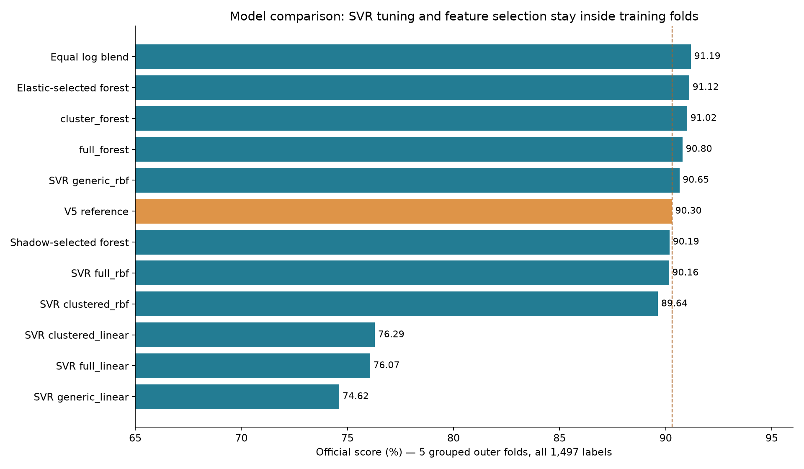
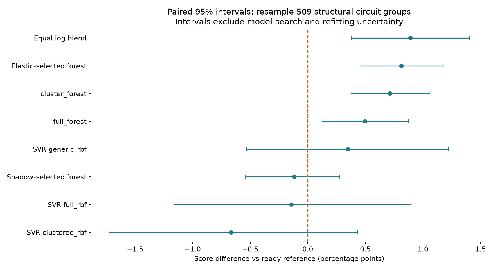

# Quantum Rings v6: SVR and feature-selection experiments

> Archived research snapshot. "Everything remains local" below describes the status when this analysis closed; this branch publishes the selected reports and figures. The v6 candidates remain unpromoted.

## Executive result

The ready v5 reference scores **90.30%** on the five grouped folds now used for every candidate. Generic RBF support vector regression scores **90.65%**; the fixed equal-weight log-space blend scores **91.19%**. See the decision addendum for deployment status. These are exploratory cross-validation estimates from previously researched data, not organizer hidden-set scores.

The user clarified **SVM**, not SVD. The runtime task uses SVR, the regression version. No PCA/SVD prediction model was fitted. Singular values appear only in the feature-redundancy diagnostic.

## Validation and final training are separate

All 532 circuits and 1,497 runtime labels participate in five outer folds. All thresholds for a circuit, and all members of its structural duplicate group, remain together. There are 509 structural groups. A model predicts a row only when its group was excluded from training. The previous internal fold-4 holdout was already consumed; it is now one ordinary CV fold.

SVR chooses C, epsilon and RBF gamma in three grouped inner folds of each outer training set. Imputation, scaling, support filtering and cluster selection are fitted again within each inner training split. The outer test labels choose none of these settings. Comparing and selecting among several outer-tested procedures still creates selection optimism; prior v5 exploration is another source. Repeatedly inventing candidates until CV improves cannot manufacture a fresh test set. This is why the final organizer evaluation remains important. [Nested CV documentation](https://scikit-learn.org/stable/auto_examples/model_selection/plot_nested_cross_validation_iris.html).

After architecture selection, final tuning uses grouped CV over all available labeled data and every component is refit on all 532 circuits under its censoring policy. No permanent local holdout is withheld from that final training. The existing `submission_v5` already follows this all-data refit policy. Its training score is not an estimate of unseen-circuit performance.

## Same-fold comparison

| Procedure | CV score | Δ pp | Paired 95% interval, pp | Fold range, % |
| --- | --- | --- | --- | --- |
| Equal log blend | 91.19% | +0.89 | [+0.38, +1.40] | 90.21–92.19 |
| Elastic-selected forest | 91.12% | +0.81 | [+0.46, +1.18] | 90.20–92.82 |
| cluster_forest_fixed_gate | 91.02% | +0.71 | [+0.38, +1.06] | 90.10–92.53 |
| full_forest_fixed_gate | 90.80% | +0.49 | [+0.12, +0.87] | 89.84–92.83 |
| SVR generic_rbf | 90.65% | +0.35 | [-0.53, +1.22] | 88.97–91.98 |
| V5 reference | 90.30% | +0.00 | [+0.00, +0.00] | 89.32–91.39 |
| Shadow-selected forest | 90.19% | -0.12 | [-0.54, +0.28] | 89.23–91.47 |
| SVR full_rbf | 90.16% | -0.14 | [-1.16, +0.90] | 88.71–91.74 |
| SVR cluster_full_cut_0.10_rbf | 89.64% | -0.66 | [-1.73, +0.43] | 88.37–91.53 |
| SVR cluster_full_cut_0.10_linear | 76.29% | -14.01 | [-15.33, -12.65] | 75.08–77.26 |
| SVR full_linear | 76.07% | -14.24 | [-15.67, -12.82] | 74.94–77.52 |
| SVR generic_linear | 74.62% | -15.69 | [-17.12, -14.24] | 73.06–75.89 |

The intervals use 5,000 paired resamples of complete structural groups. Each sampled group contributes all its measured thresholds and circuit members; the score denominator retains row weighting. These intervals describe variation in this OOF prediction sample, not uncertainty from refitting or searching many procedures. Fold ranges provide another view of heterogeneity. `comparison.csv`, `strata.csv` and every OOF prediction remain available.

## What the SVR experiments test

Linear SVR is a regularized linear control. RBF SVR models smooth nonlinear similarity in standardized feature space. C controls regularization, epsilon sets the tolerated log-time error, and gamma sets kernel locality. All are training-selected using the exact challenge score. Epsilon .03 or .10 log10 seconds roughly corresponds to multiplicative factors 1.07 or 1.26. Those are model loss settings, not official score buckets. The bounded search uses six linear and eighteen RBF configurations for each representation, with a 100,000-iteration cap and explicit convergence records. [Official SVM guide](https://scikit-learn.org/stable/modules/svm.html).

The representations are the 44-feature generic baseline, the full 325-feature inventory, and training-derived representatives from average-linkage Spearman clusters at distance .10. Qubit count, unitary count, two-qubit count and threshold inputs remain explicit. Signed log1p, training medians/scales and missing indicators handle feature magnitudes and unavailable measurements. The full inventory is not 325 independent signals: redundant coordinates can overweight a shared latent quantity in a distance kernel.

The fixed 50/50 blend averages predicted log10 seconds; in seconds it is the geometric mean. It tests whether forest and SVR errors complement one another. No blend weight was optimized against outer test predictions. It was added during implementation before complete SVR results and is labeled exploratory.

## Censoring, objective and missing features

The executable score is `max(0, 1 - abs(log10(predicted / actual))/2)`, averaged over labeled runs. Successful tenfold errors earn .5, not zero; the README/comment discrepancy remains an organizer question. Official timeouts use actual 14,400 seconds and cap the prediction at 14,400. Thus predictions at or above the cap earn full timeout credit; successful over- and under-predictions have symmetric multiplicative penalties.

The success regressors exclude the 33 official timeouts plus the 42,993.9847111-second anomalous success, treating all 34 as censored for training. The anomaly keeps its literal successful label for scoring. No artificial exact 14,400-second target is fed to ordinary SVR or forest runtime regression. A fold-trained generic timeout gate retains the v5 .25 decision cutoff. It is a decision score, not a claim of calibrated probability.

For controlled runtime comparisons, that same generic gate and trained counts-only missing-depth fallback are shared across SVR, feature subsets and forest ablations. Only the runtime representation/estimator varies. Count-missing rows use the candidate's trained missingness handling plus the shared gate. Artificial depth removal and fresh cached features test availability robustness; source/size stress is reported separately because those splits ask a harder question than within-source CV. Features are extracted from QASM and threshold at inference; runtime ratios, circuit names, source labels and held-out outcomes are never predictors.

## Feature conclusions and evidence

The descriptive inventory contains 24 all-missing fields, seven constant observed fields, 70 with fewer than 30 observations, and 308 supported pairs with absolute Spearman correlation at least .95. The standardized imputed nonconstant matrix has rank 251 of 294 and entropy effective rank 30.70. This does not prove that 31 features suffice for prediction. Information with low variance may still predict rare expensive circuits. Details, support counts and caveats appear in the feature report.

Grouped permutation perturbs a whole feature block, including its missingness, with one donor circuit shared across thresholds. The original gate and routing remain fixed. It measures reliance of a fitted runtime regressor; off-distribution combinations can exaggerate effects. Drop-group retraining asks whether other fields can replace that block. Correlated features explain why these answers differ. The learned-cluster deletion experiment separately removes five largest training-derived clusters per fold; rank labels across folds do not imply identical members. [Correlated-feature permutation example](https://scikit-learn.org/stable/auto_examples/inspection/plot_permutation_importance_multicollinear.html).

Elastic-net and shadow-selected forests are evaluated on the same held-out keys. Impurity is a biased supporting vote. The shadow method is explicitly Boruta-style, not the canonical iterative Boruta algorithm; approximate interventional group Shapley is not TreeSHAP or causal attribution. Neither a significance-style shadow threshold nor a high SHAP contribution by itself justifies feature removal. The independent agent report documents implementations and tests.

## Reproducibility and limitations

`PROTOCOL.md` records evaluation decisions; `WORK_LOG.md` records changes; each agent directory contains methods, code, outputs, tests and a handoff. Root recomputes scores from predictions and checks keys and an independent full-forest implementation. The original scorer is executed on the reference OOF CSV. Kernel portability is tested against sklearn predictions; a new deployment still needs the original harness and timing checks.

This round generates no new simulator labels. There are no new uploads: v5 and v6 stay local, as requested. The ready v5 submission remains available until a reviewed replacement passes promotion checks. Source-family extrapolation, sparse timeouts, parsing-budget missingness, unknown hidden-set composition and the unresolved meaning of simulator threshold remain material limits.

## Reviewed decision and follow-up

### Deployment and next round

## Decision

**Keep the existing all-data v5 submission as the ready default.** The fixed equal-weight forest/SVR blend is the ordinary grouped-CV leader at **91.19%**, above the reference's **90.30%**. Its paired group-bootstrap gain is **+0.89 percentage points [0.38, 1.40]**, and all five folds improve. Those are exploratory, selection-affected estimates. They do not establish that the blend is best for an unknown source mix.

The source-exclusion tests materially change the recommendation: the blend loses 3.49, 7.03 and 7.81 points against the reference when other QASM2, QASM3 and Sycamore-like QASM2 are each excluded from training. The cluster forest has **91.02%** ordinary CV and smaller losses on this stress suite, but it still loses **4.71 points** on the new Sycamore-like source. The elastic-selected forest reaches **91.12%** CV with 59–134 selected fields across folds; its stress scores improve on the reference for larger sizes, other QASM2 and QASM3, but fall **6.04 points** for Sycamore-like circuits. The generic RBF kernel helps size extrapolation while struggling with entirely new feature distributions. These tests are conservative stress scenarios, not a forecast of the organizer's unknown source mixture. There is no uniquely proven best model across them.

## Stress results

| Test | Labels | Reference | Elastic forest | Cluster forest | RBF SVR | Equal log blend |
| --- | --- | --- | --- | --- | --- | --- |
| Larger sizes | 452 | 82.00% | 82.04% | 81.75% | 87.29% | 87.06% |
| Exclude other QASM2 | 392 | 69.38% | 70.37% | 70.74% | 61.65% | 65.89% |
| Exclude QASM3 | 535 | 69.90% | 71.61% | 71.26% | 53.32% | 62.87% |
| Exclude Sycamore-like | 570 | 82.68% | 76.63% | 77.97% | 64.85% | 74.86% |

All source/size predictions use held-out structural groups. The source labels are content/source proxies, not verified algorithm families; the other-QASM2 group mixes origins. SVR hyperparameters are tuned on each stress training portion only. The source stress tests use overlapping populations; do not average them into a headline score or treat them as independent trials. The two additional source splits were added after ordinary CV results and before their stress outcomes. The root independently reproduced the agent's blend calculation.

Elastic stress tests reproduce the standalone ElasticNet inner selector followed by the final forest, gate and fallback. Their alpha/L1 choice is training-only; selected inner and final selector fits converged. All four tests are follow-ups to its strong ordinary CV result. Artificial missingness scenarios below were evaluated for the reference, cluster forest and RBF/blend; no elastic-forest missingness result is claimed.

## Missing-feature results

| Available inputs | Reference | Cluster forest | RBF SVR | Equal log blend |
| --- | --- | --- | --- | --- |
| live | 90.37% | 91.08% | 90.73% | 91.27% |
| missing_depth | 88.92% | 88.93% | 89.09% | 89.02% |
| qubits_only | 43.75% | 43.87% | 49.99% | 47.74% |

The missing-depth specialist remains useful. When almost all structure is removed, every model is weak; better performance than the reference in that extreme does not make the predictions reliable. The fresh-feature scenario uses a previously saved extraction audit, not a newly timed parser pass.

## All-data training and portability

The new generic RBF research artifact is fitted on all **532 circuits / 1497 labels**: 1463 observed-success rows train the runtime regressor and 34 censored rows also inform the shared gate. Its final three-fold training-only selection chose C=100, gamma=1/transformed dimension and epsilon=.03. It has 1019 support vectors and converged. This final tuning score is not a second independent evaluation.

The isolated standard-library probe produced **1596 positive finite predictions**, plus 15 edge-case predictions. Prediction time was median **0.0196 s**, p95 **0.0289 s**, maximum **0.0347 s** on this machine. Numpy/sklearn were not loaded. This verifies the exported inference functions on cached features; it is not a new end-to-end harness acceptance test. The research SVR/blend has not replaced `submission_v5`, and no new official submission was made.

The existing v5 submission already trains on all 532 circuits and has its original harness evidence. The new SVR portable JSON and training manifest are in `svr/final_all_data/`; its validation estimates are the saved outer predictions, not in-sample scores. Generic linear SVR is ineligible for promotion because one selected outer fit did not converge; all three RBF procedures' selected fits converged.

## What the feature work tells us

Correlated-feature pruning is model-dependent. Cluster representatives improve this forest but worsen RBF SVR compared with the compact generic input. Strong permutation effects can coexist with near-zero deletion effects because another block can replace the information after refitting. For example, temporal/barrier permutation loses 7.64 points, while deleting that block and retraining slightly improves this forest. Native and RCM cuts show the same distinction on a smaller scale. This supports retaining multiple measurement methods rather than treating any one ranking as truth.

The core size/count block has the largest positive deletion effect, roughly .54 points; angle summaries add about .22 points in this setup. The paired deletion intervals in the feature report must accompany these small effects. No conclusion here proves a simulator bond cap or causally identifies an entanglement mechanism.

## Next round — planned, not started

1. **Train-only distance-aware blending.** Use circuit-feature distance or kernel similarity to reduce the SVR contribution on unfamiliar inputs, falling back toward the forest. Derive distance scales from training circuits, tune the blending rule only in grouped inner folds, and assess all four stress tests. Avoid source/file-name rules or a gate trained on outer-test errors.
2. **Trend plus residual SVR.** Give the prediction an explicit regularized size/threshold trend and train SVR on residuals. Compare with the forest/SVR blend using the same score and censor policy. This tests a way to reduce an RBF model's tendency toward a constant away from its training support.
3. **Test selection stability, not a universal rank.** Carry a compact generic representation, the forest's cluster representatives and any stable supervised subset into those tests. Use training-fold selection frequencies and deletion intervals; do not reuse a full-data feature ranking as a CV selector.
4. **Address timeout decisions separately.** Preserve censoring and the working gate initially; tune any new gate or expected-score decision only inside grouped training folds, with explicit false-timeout costs on successful rows. Recheck the single over-cap success under the already documented sensitivity policies.
5. **Promote once.** Choose the pipeline and tuning rule, fit all components on all available data, package it as one portable model, and run the original harness and inference fallback/timing checks. Keep the previous ready submission until that passes. Use the organizer's true hidden set only when provided.

Everything remains local. W&B v4 is unchanged; no v5/v6 upload was attempted. No Quantum Rings simulation or extra runtime-label compute was performed.
